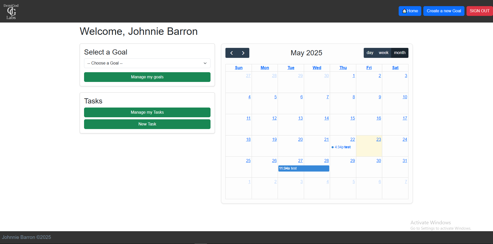
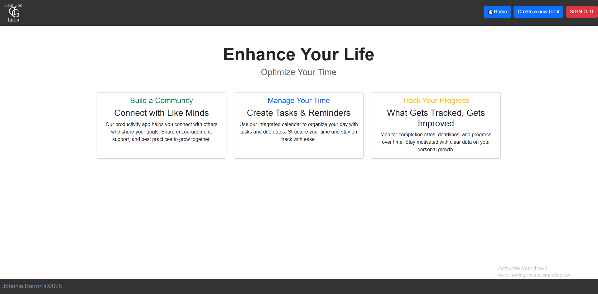

# ElevateSelf

ElevateSelf is a productivity web app designed to help users set meaningful goals, break them down into actionable tasks, and schedule those tasks on a visual calendar. Whether you're managing personal goals, work projects, or daily routines, ElevateSelf provides a clear structure to stay organized and on track.

## 🧠 Background

The app was built to support better goal-setting habits and time management by combining task planning with calendar visualization. It's ideal for individuals who want to level up their productivity, track progress, and maintain focus over time. The idea for this app came to be because I have severe ADHA, the primary symptom being executive dysfunctin. The method I have found for managing this is by creating specific task with specific times to have this done by, I made ElevateSelf to help with this. It enables the creation and organization of Goals and task and automaticaly organizes them by when they need done helping visualizes your schedule while offereing positive feed back every time you complete a task.

## 🖼️ Screenshot

## 🚀 Technologies Used

- JavaScript
- HTML
- CSS
- Node.js
- Express
- MongoDB
- Mongoose
- Bootstrap (CSS Framework)
- FullCalendar (Calendar Library)

## 🛠️ Getting Started

- [Click to View Elevate](https://elevateself-828b3b1b74f3.herokuapp.com/)

## 📈 Next Steps

Here are some features planned for future versions of Elevate:

- **KPI Tracking** – Measure progress on goals with visual indicators and stats.
- **Community Page** – Connect with other users, share goals, and support one another’s growth.

---

Feel free to fork this project, contribute, or provide feedback!
